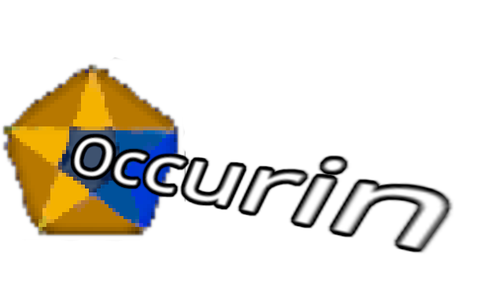

<div align="center">

</div>

# Occurin

A social events app that lets users browse and sign up to events.

*Please note, whilst this project is made with react native it currently only supports web*

[Online Hosted Version](https://main--occurin.netlify.app/)

## Features

- Sign-in using Google
- Calendarised Feed
- Scroll horizontally per week
- Create events with pictures and location information
- Filter events by weekday
- Save events to your own saved events section.
- Add your saved events to a google calendar

## Tech stack

- **React Native**: Designed to work on Web, Android and iOS
- **Expo**: A frame fir react-native which streamlines deployment, testing and configuration.
- **TypeScript**: App developed with strict TypeScript configuration to ensure type safety between client and backend
- **Supabase**: Supabase provides all backend services including Postgres database, authentication and image storage
- **Others**: React native paper, Shopify Flashlist,Tanstack React query,Day.js, Mapbox gl,react hook forms

## Using the App

The app is fairly straight forward to use but here's some steps:

### 1. Create an account

Start by signing in using google sign-in or creating a new account using a password.

### 2. Browse events

View events using the calendar feed which is located on the "Home" tab. Events are divided into weeks which are scrolled vertically and days which are scrolled horizontally. You may click on an event to view more information or save it to your saved events to view it later.

### 3. Create events

Create events using the Event creator which is located on the "Create Event" tab. Enter all of the information for your event, upload a picture and press create event when you are finished.

### 4. Save events

Saved events are located on the "Saved" tab. Here you may view your events in an identical manner to the home calendar feed. If you would like to save your events to your google calendar you may press :save events to google calendar"

### 5. Change your profile settings

Profile Settings are located on the "Profile" tab. Here you may set your username, full name, personal website and profile picture. In case you haven't logged in using a google account, you may link your google one here. lastly you may sign out here.

## Running the app locally

Due to the backend being hosted on supabase and the app using mapbox search and google calendar APIs it isn't possible to run this app locally unless you have the .env file with all of these variables:

```env
EXPO_PUBLIC_SUPABASE_URL=
EXPO_PUBLIC_ANON_KEY=
EXPO_PUBLIC_MAPBOX_OCCURIN_TOKEN=
EXPO_PUBLIC_GOOGLE_CALENDAR_API=
EXPO_PUBLIC_GOOGLE_CLIENT_ID=
```

Please contact the developer of this project if you would like to run this project locally using the environment variables.
If you had the variables you could run the project locally like this....

- download the repo
- install dependencies using...

```bash
npm install
```

or..

```bash
yarn
```

then run using...

```bash
npx expo start
```
